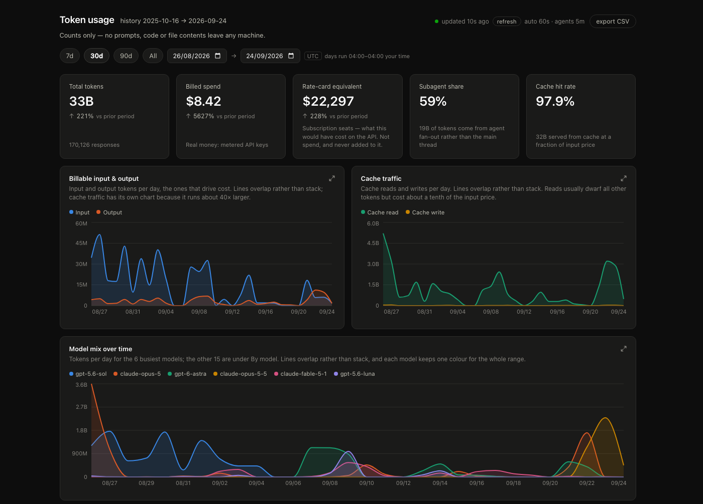

<p align="center">
  
</p>

<p align="center">
  <em>Token usage across every AI coding agent on your Mac —<br>
  collected locally, counted once, and never carrying a line of code.</em>
</p>

---

A small collector reads the session logs your coding agents already write and
sends the token counts to a server on the same Mac, which shows them on a
dashboard at http://127.0.0.1:8790. Nothing is hosted anywhere else.

<p align="center">
  
</p>

## Run it

You need macOS, Go 1.27, Node 24, and the GitHub CLI signed in
(`brew install gh && gh auth login`).

```bash
git clone https://github.com/samiashi/llm-tracker.git && cd llm-tracker
make build                          # the dashboard, then both binaries into bin/
./bin/llm-tracker-server install    # the dashboard at http://127.0.0.1:8790, now and at every login
./bin/llm-tracker-agent enroll      # join the server as your GitHub login
./bin/llm-tracker-agent install     # collect and upload at login and every 5 minutes
```

Both run in the background as LaunchAgents, each from its own copy of its
binary: the server with its database and log in `~/.llm-tracker-server`, the
collector with its archive in `~/.llm-tracker`. While the server is stopped the
collector keeps collecting, and it uploads the backlog once the server is back.

```bash
./bin/llm-tracker-agent status      # running? last upload?
./bin/llm-tracker-agent uninstall   # stop; rm -rf ~/.llm-tracker also deletes the local archive
./bin/llm-tracker-server uninstall  # stop; the database stays in ~/.llm-tracker-server
```

To update, pull, run `make build`, and run both installs again: each runs its
own copy of its binary, which only `install` replaces.

## What is tracked

| Verified on real installs                   | Built from documentation (`llm-tracker-agent probe <name>` to check)                               |
| ------------------------------------------- | -------------------------------------------------------------------------------------------------- |
| Claude Code, Claude Cowork, Codex, opencode | Gemini CLI, GitHub Copilot CLI, Kimi Code, DeepSeek Harness, Z.ai ZCode, Cline, Roo Code, Continue |

Models reached through Claude Code (GLM, Kimi, DeepSeek) count with it.
Cursor, Windsurf and the ChatGPT app keep no usable token record on disk, so
they are not tracked. An adapter for them would report confident, wrong
numbers.

Claude Code deletes its transcripts after 30 days. The collector's archive in
`~/.llm-tracker` is the only lasting copy, so keep the collector installed.

## What is stored

Token counts, with what is needed to break them down:

- model, provider and timestamps;
- session IDs;
- the hostname and a hash of the hardware ID;
- the email of each signed-in account.

**Never prompts, responses, code, diffs or tool arguments.** The event type
has no field for them, and a test fails if one is added. The server listens on
127.0.0.1 only, and the one call it makes is at enrolment, when it asks GitHub
whose `gh` token it was given. The token is not stored.

## Reading the numbers

- **Three spend figures, never added together.** _Billed_ is metered API
  spend. _Rate-card equivalent_ prices subscription usage at API rates, which
  is what it would have cost. _Basis unknown_ is usage the collector cannot
  place in either.
- **Cache reads have their own chart.** They are most of the tokens and bill
  at a fraction of input, so charted with everything else they flatten it.
- **Days are UTC days.** The dashboard says when one starts on your clock.
- **Unpriced means unknown, not free.** A model missing from the price table
  is counted but not costed.

## Development

```bash
make test                       # Go under two time zones, the price generator, the dashboard
make lint                       # must be clean; needs golangci-lint
make run-server                 # the server from source, with verbose logs
cd dashboard && npm run dev     # the dashboard with hot reload at http://127.0.0.1:5178
```

`make run-server` serves on the installed server's address and database, so run
`./bin/llm-tracker-server uninstall` first, and install it again afterwards.

[AGENTS.md](AGENTS.md) holds the invariants: the rules that, broken, produce
wrong numbers rather than errors. Read it before changing the adapters, the
schema or the queries.

## License

[MIT](LICENSE)
